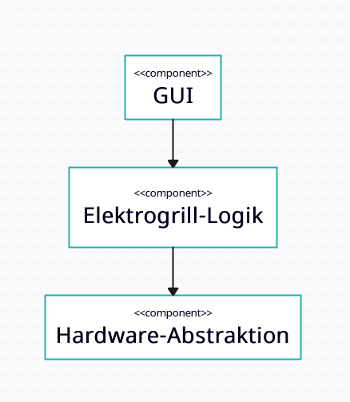

# Architektur
## Komponentendiagramm

| **Komponente**       | **Requirements**   |
|----------------------|--------------------|
| GUI                  | F1.1, F2.1, F3, F4 |
| Elektrogrill-Logik   | F1.2, F4           |
| Hardware-Abstraktion | F2.2               |

## Zuständigkeiten der Komponenten
| **Komponente**       | **Rolle**             | **Zweck/Zuständigkeit**                                                                       |
|----------------------|-----------------------|-----------------------------------------------------------------------------------------------|
| GUI                  | Präsentationsschicht  | Anzeige der eingestellten & aktuellen Temperatur und des Drehrads zur Änderung der Temperatur |
| Elektrogrill-Logik   | Business-Logik        | Änderung der Wunschtemperatur, Logik der Lämpchen/"On-Off"-Anzeige                            
| Hardware-Abstraktion | Hardware-Interface    | regelmäßige Aktualisierung der aktuellen Temperatur                                           |