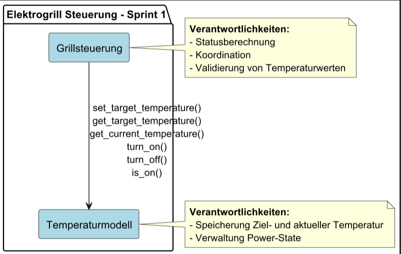

# Architektur Sprint 1

## Architekturmuster festlegen

**Schichtenarchitektur**:

- Trennung der Verantwortlichkeiten (Steuerungslogik und Datenmodell)
- Jede Schicht ist unabhängig testbar und austauschbar
- Komponenten nach funktionaler Rolle gruppiert → Kapselung und Entkopplung
- Jede Schicht darf nur die direkt darunterliegende Schicht ansprechen

## Komponentendiagramm

| **Komponente**       | **Requirements**           |
|----------------------|----------------------------|
| Grillsteuerung       | F1.1, F1.2, F2, F3, F4, F5 |
| Temperaturmodell     | F1.1, F1.2, F2, F4         |

**Verantwortlichkeiten der Komponenten:**

| **Komponente**       | **Rolle**              | **Verantwortlichkeiten**                                                    |
|----------------------|------------------------|-----------------------------------------------------------------------------|
| Grillsteuerung       | Business-Logik         | Statusberechnung, Koordination, Validierung von Temperaturwerten           |
| Temperaturmodell     | Datenmodell            | Speicherung von Ziel- und aktueller Temperatur, Verwaltung Power-State     |

## Schnittstellendefinition

| **Ziel**             | **Quelle**           | **Schnittstellen**                                                                          |
|----------------------|----------------------|---------------------------------------------------------------------------------------------|
| Grillsteuerung       | Temperaturmodell     | `set_target_temperature()`, `get_target_temperature()`, `get_current_temperature()`, `turn_on()`, `turn_off()`, `is_on()` |

## Technologiestack

| Kategorie                | Technologie / Tool   | Begründung                                                               |
|--------------------------|----------------------|--------------------------------------------------------------------------|
| Sprache                  | Python 3.x           | Requirements-Vorgabe, einfache Syntax, schnelle Entwicklung             |
| Versionskontrolle        | Git + GitHub         | Standard                                                                 |
| IDE                      | VS Code / PyCharm    | Leichtgewichtig, Python-Support                                          |
| Test-Framework           | unittest / pytest    | Standard für Python, einfach integrierbar                                |
| Dokumentation            | Markdown + PlantUML  | Für Anforderungen & Architektur, einfache Modellierung                   |
