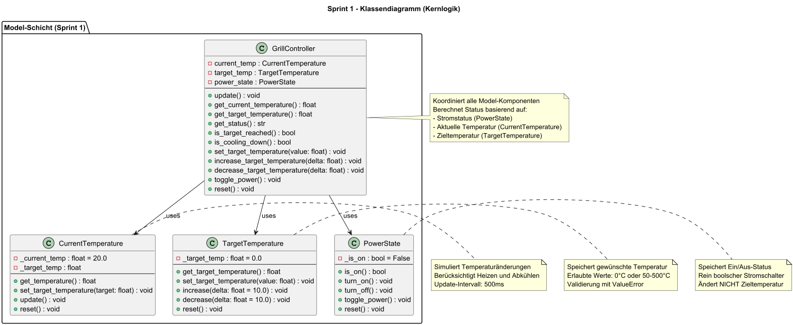
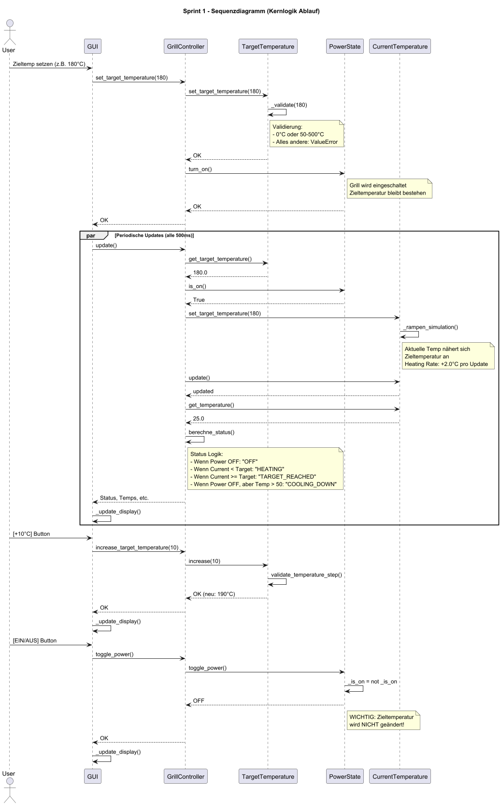

# Design Sprint 1 – Kernlogik

## Klassendiagramm

---

## Sequenzdiagramm

---

## Klare Klassen- und Methodensignaturen
- Klassen:
  - **CurrentTemperature**
  - **TargetTemperature**
  - **GrillController**
  - **PowerState**
- Öffentliche Methoden:
  - **set_temperature(value)**
  - **get_temperature()**
  - **is_valid(value)**
  - **is_target_reached()**
  - **turn_on() / turn_off()**

---

## Defensive Design
- Ungültige Temperaturwerte (<50 oder >500 °C) werden abgefangen.
- Private Hilfsmethoden:
  - **_validate(value)**

---

## Erweiterbarkeit
- Design ermöglicht spätere Ergänzung der GUI ohne Änderungen der Kernlogik.
- Klare Trennung zwischen **Model** und späterer GUI (**View/Controller**).

---

## Zustandsorientiertes Design
- Einfache Statuswerte:
  - **ON**
  - **OFF**
  - **TARGET_REACHED**
  - **COOLING_DOWN**
