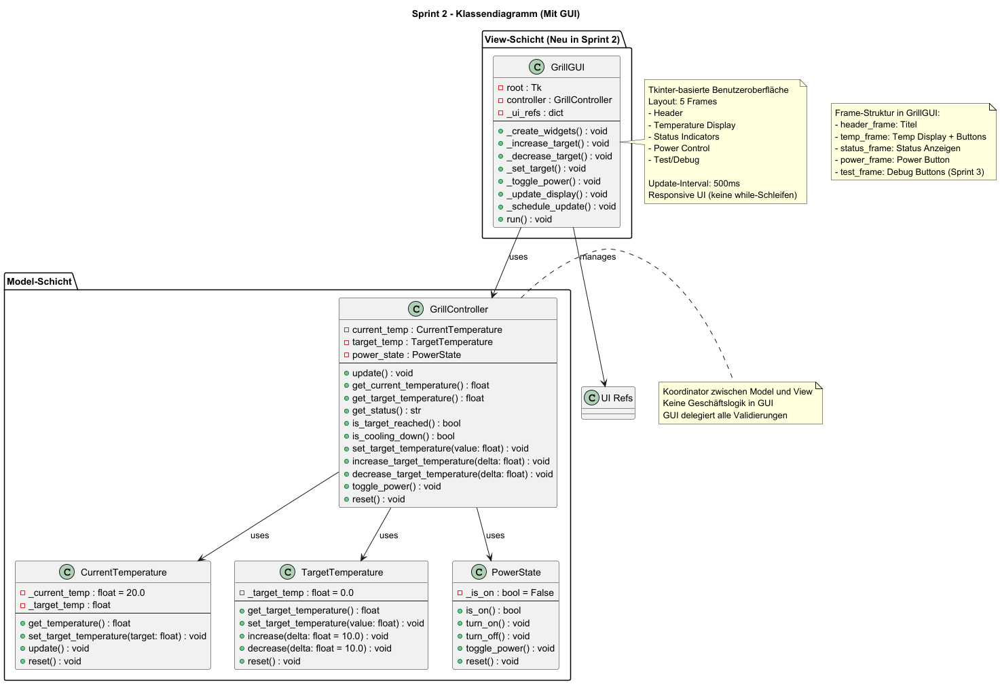

# Design Sprint 2 – GUI
Designmäßig habe ich mich für ein simples tkinter-Fenster entschieden, bei dem für "AN" und "AUS" Zustände grün bzw. rot 
hergenommen wird. Ansonsten wird als neutrale Farbe blau benutzt, damit das Design nicht zu langweilig ausschaut.
Auch wurde für die Erhöhung der Zieltemperatur die Farbe "Grün" und die Senkung dieser die Farbe "Orange" gewählt, 
sodass auch dieses beiden Buttons gut erkennbar sind.
## Layoutstruktur
- **HeaderFrame**: Titel des Systems
- **TemperatureFrame**: Anzeige aktuelle Temperatur, Wunschtemperatur, Buttons + / –
- **StatusFrame**: Zieltemperaturstatus, Resttemperaturstatus
- **PowerFrame**: An-/Aus-Button, Statusanzeige

## Zentrale Widgets
- **Label**: Temperaturanzeigen
- **Button**: Benutzerinteraktion
- **Frame**: Strukturierung der GUI
- Optional: **Canvas** für Statusindikatoren

## GUI-Methoden
- **update_display()**: Aktualisiert alle Anzeigen regelmäßig
- **increase_target_temperature()**, **decrease_target_temperature()**
- **toggle_power()**
- **refresh_status_indicators()**

## Klassendiagramm

## Hinweise
- GUI bleibt lose gekoppelt an **GrillController**.
- Keine Berechnung oder Validierung in der GUI.
