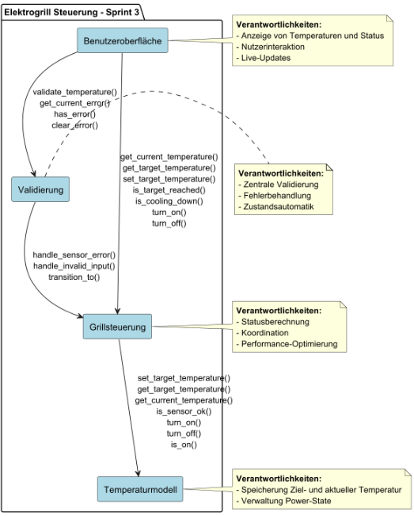

# Architektur Sprint 3

## Architekturmuster festlegen

**Schichtenarchitektur mit Validierung**:

- Trennung der Verantwortlichkeiten (Benutzeroberfläche, Validierung, Steuerungslogik und Datenmodell)
- Jede Schicht ist unabhängig testbar und austauschbar
- Komponenten nach funktionaler Rolle gruppiert → Kapselung und Entkopplung
- Jede Schicht darf nur die direkt darunterliegende Schicht ansprechen
- Zentrale Validierungs- und Fehlerbehandlungsschicht

## Komponentendiagramm

| **Komponente**       | **Requirements**                      |
|----------------------|---------------------------------------|
| Benutzeroberfläche   | F1.3, F6, F7, NF6.2, NF6.5, NF6.6     |
| Validierung          | F6.1, F6.2, F6.3, F6.4, F2.1, F8      |
| Grillsteuerung       | F1.1, F1.2, F2, F3, F4, F5, F7, NF6.3 |
| Temperaturmodell     | F1.1, F1.2, F2, F4                    |

**Verantwortlichkeiten der Komponenten:**

| **Komponente**       | **Rolle**              | **Verantwortlichkeiten**                                                    |
|----------------------|------------------------|-----------------------------------------------------------------------------|
| Benutzeroberfläche   | Präsentationsschicht   | Anzeige von Temperaturen und Status, Nutzerinteraktion, Live-Updates       |
| Validierung          | Validierungs-/Fehlerbehandlungsschicht | Zentrale Validierung, Fehlerbehandlung, Zustandsautomatik |
| Grillsteuerung       | Business-Logik         | Statusberechnung, Koordination, Performance-Optimierung                    |
| Temperaturmodell     | Datenmodell            | Speicherung von Ziel- und aktueller Temperatur, Verwaltung Power-State     |

## Schnittstellendefinition

| **Ziel**             | **Quelle**           | **Schnittstellen**                                                                          |
|----------------------|----------------------|---------------------------------------------------------------------------------------------|
| Benutzeroberfläche   | Validierung          | `validate_temperature()`, `get_current_error()`, `has_error()`, `clear_error()`           |
| Benutzeroberfläche   | Grillsteuerung       | `get_current_temperature()`, `get_target_temperature()`, `set_target_temperature()`, `is_target_reached()`, `is_cooling_down()`, `turn_on()`, `turn_off()` |
| Validierung          | Grillsteuerung       | `handle_sensor_error()`, `handle_invalid_input()`, `transition_to()`                      |
| Grillsteuerung       | Temperaturmodell     | `set_target_temperature()`, `get_target_temperature()`, `get_current_temperature()`, `is_sensor_ok()`, `turn_on()`, `turn_off()`, `is_on()` |

## Technologiestack

| Kategorie                | Technologie / Tool   | Begründung                                                               |
|--------------------------|----------------------|--------------------------------------------------------------------------|
| Sprache                  | Python 3.x           | Requirements-Vorgabe                                                     |
| GUI-Framework            | Tkinter              | Requirements-Vorgabe (NF6.2)                                             |
| Performance-Monitoring   | time.perf_counter()  | Python-Standard, hochauflösende Zeitmessung                              |
| Logging                  | logging-Modul        | Zustandswechsel-Logging für Debugging                                    |
| Versionskontrolle        | Git + GitHub         | Standard                                                                 |
| IDE                      | VS Code / PyCharm    | Python-Support                                                           |
| Test-Framework           | unittest / pytest    | Erweiterte Tests für neue Komponenten                                    |
| Dokumentation            | Markdown + PlantUML  | Für Anforderungen & Architektur, einfache Modellierung                   |
