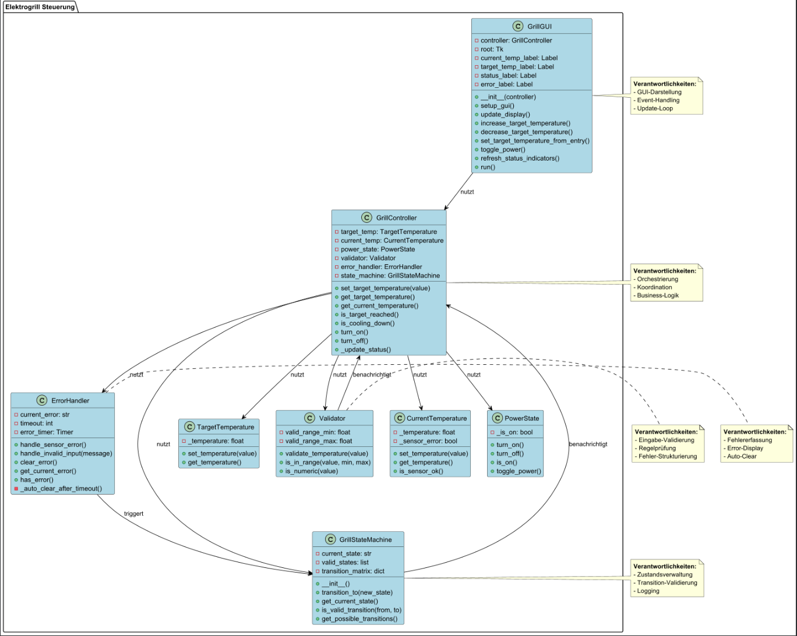
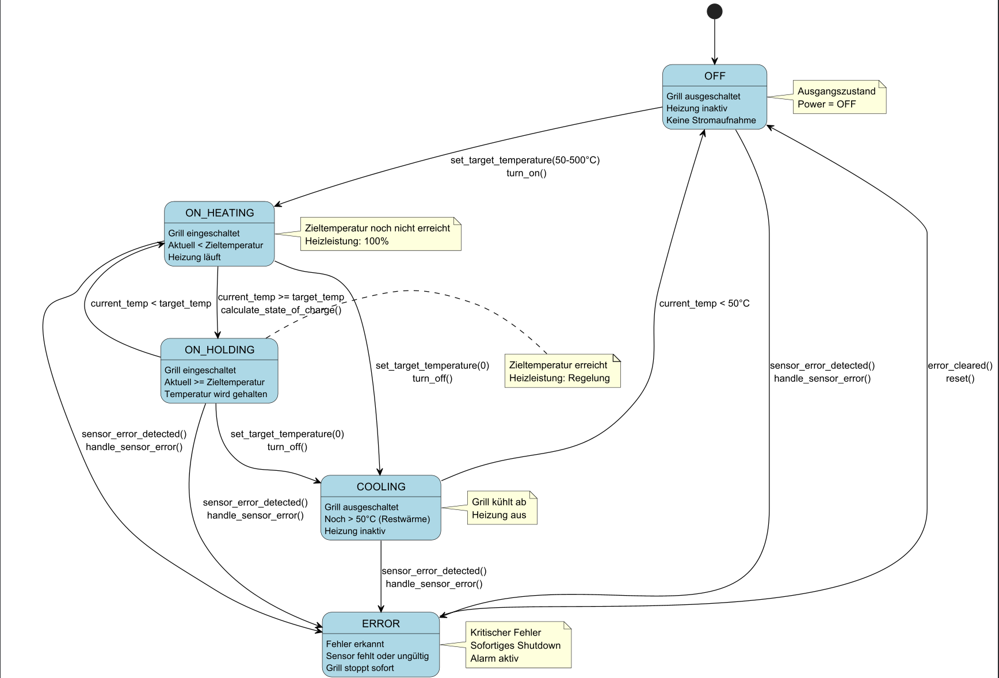
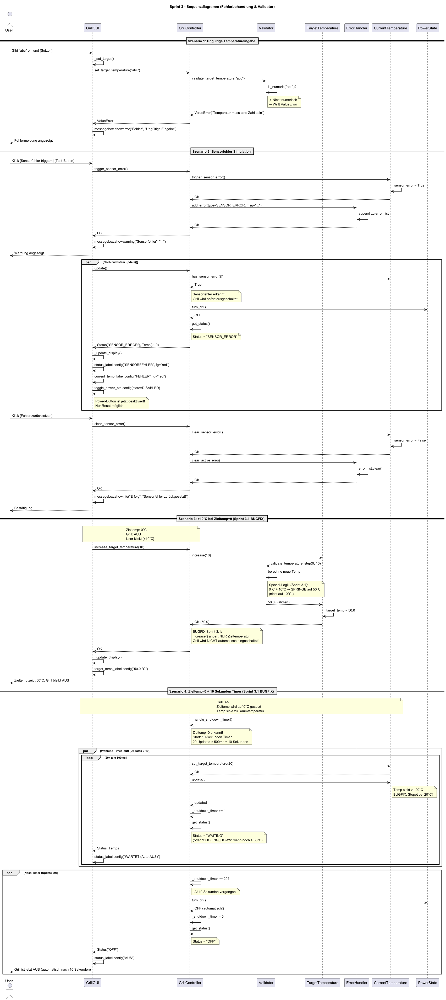
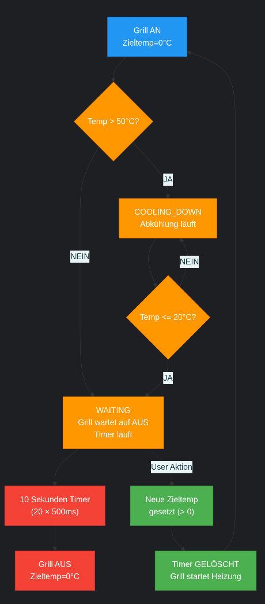

# Design Sprint 3 – Fehlerbehandlung & Performance
Bezüglich des Designs gab es in Sprint 3 nicht allzu viele Änderungen, jedoch wurden bestimmte
Status abgeändert, wodurch sich teilweise Buttons und damit auch das GUI-Fenster vergrößert haben.

## Klassendiagramm


---

## Zustandsdiagramm


---



---

## Klasse Validator
**Zentrale Validierungsklasse**

### Öffentliche Methoden:
- **validate_temperature(value)**: Validiert Temperaturwerte
  - Rückgabe: `(is_valid: bool, error_message: str)`
- **is_in_range(value, min, max)**: Prüft Wertebereich
- **is_numeric(value)**: Prüft, ob Wert numerisch ist
- **get_valid_range()**: Liefert gültigen Temperaturbereich (50-500°C)

### Private Methoden:
- **_check_type(value)**: Typ-Validierung
- **_check_bounds(value)**: Bereichs-Validierung

---

## Klasse ErrorHandler
**Zentrale Fehlerbehandlung**

### Öffentliche Methoden:
- **handle_sensor_error()**: Behandelt Sensorfehler
- **handle_invalid_input(message)**: Behandelt ungültige Eingaben
- **clear_error()**: Löscht aktuelle Fehleranzeige
- **get_current_error()**: Liefert aktuellen Fehler
- **has_error()**: Prüft, ob aktuell ein Fehler vorliegt

### Attribute:
- **current_error**: Aktueller Fehlertext
- **error_timestamp**: Zeitpunkt des Fehlers
- **auto_clear_timeout**: Timeout für automatisches Löschen (10 Sekunden)

---

## Klasse GrillStateMachine
**Deterministischer Zustandsautomat**



### Zustände:
- **OFF**: Grill ausgeschaltet, Temperatur < 50°C
- **ON_HEATING**: Grill an, aktuelle < Zieltemperatur
- **ON_HOLDING**: Grill an, aktuelle >= Zieltemperatur
- **COOLING**: Grill aus, aber Temperatur >= 50°C
- **ERROR**: Sensorfehler oder kritischer Fehler

### Öffentliche Methoden:
- **transition_to(new_state)**: Zustandsübergang durchführen
- **get_current_state()**: Aktuellen Zustand liefern
- **is_valid_transition(from_state, to_state)**: Prüft Gültigkeit
- **get_possible_transitions()**: Liefert mögliche Übergänge

### Zustandsübergänge:
```
OFF → ON_HEATING: Zieltemperatur gesetzt (50-500°C)
ON_HEATING → ON_HOLDING: Aktuelle >= Zieltemperatur
ON_HOLDING → ON_HEATING: Aktuelle < Zieltemperatur
ON_HEATING → COOLING: Zieltemperatur = 0
ON_HOLDING → COOLING: Zieltemperatur = 0
COOLING → OFF: Aktuelle < 50°C
* → ERROR: Sensorfehler erkannt
ERROR → *: Fehler behoben
```

---

## Refactoring GrillGUI
**Entfernung redundanter Logik**

### Änderungen:
- Entfernung aller GUI-internen Validierungen
- GUI ruft nur noch `Validator.validate_temperature()` auf
- Fehleranzeigen über `ErrorHandler` gesteuert
- Keine direkten Model-Änderungen mehr

### Neue Methoden:
- **display_error(error_message)**: Zeigt Fehler an
- **clear_error_display()**: Löscht Fehleranzeige

---

## Integration GrillController
**Verwendung des Zustandsautomaten**

### Änderungen:
- `GrillController` nutzt `GrillStateMachine` für Zustandsverwaltung
- Alle Zustandswechsel über `state_machine.transition_to()` 
- Logging aller Zustandswechsel

---

## Hinweise
- Validator ist stateless und kann überall verwendet werden
- ErrorHandler verwaltet Fehler-Zeitstempel für Auto-Clear
- GrillStateMachine garantiert deterministische Übergänge
- Alle Komponenten sind lose gekoppelt und testbar
